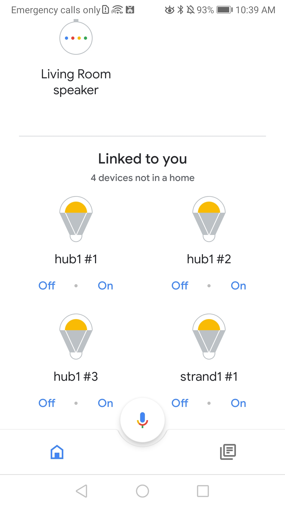

### Goal

Trigger Identify request from MDNS scan.

---

### Problem

Currently, I try to trigger Identify request from a MDNS scan with a hub. But no Identify request is send. Although, when i worked in my previous office with many hubs and devices, MDNS scan successfully triggered Identify request. Today, I just work with one hub and no discovarable devices from MDSN scan, here, no Identify request is send anymore. 

---

### Environnement when it works

| Packages               | Version       |
| --------------------- |:-------------:|
| google/local-home-sdk | 0.2.1         |
| typescript            | 3.5.1         |

| Devices               | Details |
| --------------------- | ------- |
| google nest mini | 2nd Generation |
| Hager hubs | devices that respond to MDNS scan |
| Controllable devices | Present in room i worked |

---

### Current environement, it doesn't work

| Packages               | Version       |
| --------------------- |:-------------:|
| google/local-home-sdk | 1.0.0         |
| typescript            | 3.5.1         |

| Devices               | Details |
| --------------------- | ------- |
| google nest mini | 2nd Generation |
| Virtual hub | proposed by google sample here: https://github.com/actions-on-google/smart-home-local |
| Controllable devices | not present in room i work |

|   Google home nest mini           |   |
| --------------------- | :------------: |
| System Firmware | 200660 |
| Cast Firmware               |       1.46.200660     |
| Language                 |     Français      |
| Country Code             |    FR     |

## MDNS Configuration

Configuration in Google Action console: `Develop -> Actions -> Add device scan configuration`

MDNS query actually triggered :

## Code actually load

Configuration in Google Action console: `Develop -> Actions -> Enter your testing Url`

## Virtual device in my google home app

 

